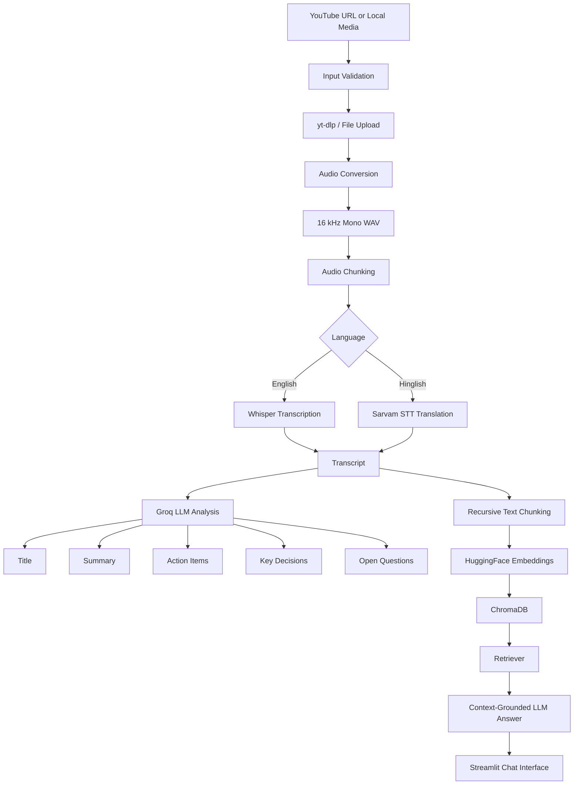

<div align="center">

# 🎥 AI Video Assistant

### Turn long videos and meetings into searchable, actionable knowledge.

<p>
<a href="https://github.com/Div7anshKushwaha/ai-video-assistant">
    
  </a>
  
  
  
</p> <p>
  <a href="#-features">Features</a> •
  <a href="#-architecture">Architecture</a> •
  <a href="#-quick-start">Quick Start</a> •
  <a href="#-engineering-details">Engineering</a> •
  <a href="#-roadmap">Roadmap</a>
</p> </div>

---

## ✨ Overview

**AI Video Assistant** is an end-to-end AI application that converts YouTube videos and local audio/video files into searchable knowledge.

It combines speech-to-text, LLM-based meeting analysis, vector retrieval, and retrieval-augmented generation in one Streamlit application.

> **Current status:** Working AI application prototype with English/Hinglish transcription, structured meeting analysis, persistent vector retrieval, and transcript-based Q&A.

### What it can do

```
YouTube URL / Local Media
          ↓
   Audio Processing
          ↓
  Speech Transcription
          ↓
  Meeting Understanding
          ↓
   Searchable Knowledge Base
          ↓
      RAG Q&A
```

---

## 🎯 Why this project?

Long videos and meetings often contain useful information that is difficult to revisit. This project explores how AI can turn unstructured audio into a practical knowledge interface.

The application is designed to answer questions such as:

- What were the main topics discussed?

- What decisions were made?

- Who owns each action item?

- What questions remain unresolved?

- Where in the transcript was a particular topic discussed?

---

## 🚀 Features

| Feature | Description |
| --- | --- |
| 🎬 YouTube input | Download audio from a public YouTube video using `yt-dlp` |
| 📁 Local media input | Upload supported audio and video files |
| 🗣️ English transcription | Local transcription using OpenAI Whisper |
| 🇮🇳 Hinglish transcription | Optional Hinglish-to-English transcription using Sarvam AI |
| 📝 Meeting summary | Generate a concise summary from long transcripts |
| ✅ Action items | Extract tasks, owners, and deadlines |
| 🔑 Key decisions | Identify decisions made during the conversation |
| ❓ Open questions | Extract unresolved questions and follow-up topics |
| 🔎 Semantic search | Search transcript content using embeddings |
| 💬 RAG Q&A | Ask questions grounded in the transcript |
| ⚡ Progress tracking | Display the current pipeline stage in the UI |
| 🛡️ Friendly errors | Convert common configuration and API failures into useful messages |

---

## 🧠 Architecture



### Application layers

```
app.py
├── Streamlit interface
├── Input validation
├── Session state
├── Progress display
└── User-friendly error handling

main.py
├── Pipeline orchestration
└── CLI entry point

core/
├── transcriber.py
├── summarizer.py
├── extractor.py
├── vector_store.py
└── rag_engine.py

utils/
└── audio_processor.py
```

---

## 🛠️ Technology Stack

| Layer | Technology |
| --- | --- |
| User interface | Streamlit |
| Language | Python |
| YouTube extraction | `yt-dlp` |
| Audio processing | `pydub`, FFmpeg |
| English speech-to-text | OpenAI Whisper |
| Hinglish speech-to-text | Sarvam AI |
| LLM provider | Groq |
| LLM orchestration | LangChain |
| Embeddings | HuggingFace `all-MiniLM-L6-v2` |
| Vector database | ChromaDB |
| Testing | Pytest-compatible test modules |
| Development | Dev Containers / GitHub Codespaces support |

---

## 📁 Project Structure

```
ai-video-assistant/
│
├── .devcontainer/
│   └── devcontainer.json
│
├── core/
│   ├── extractor.py          # Action items, decisions, questions
│   ├── rag_engine.py         # RAG chain and question answering
│   ├── summarizer.py         # Title and summary generation
│   ├── transcriber.py        # Whisper and Sarvam transcription
│   └── vector_store.py       # Chunking, embeddings, ChromaDB
│
├── utils/
│   └── audio_processor.py    # Downloading, conversion, chunking
│
├── tests/
│   ├── test_components.py
│   └── test_youtube.py
│
├── app.py                    # Streamlit application
├── main.py                   # End-to-end pipeline and CLI
├── packages.txt              # System packages for deployment
├── requirements.txt          # Python dependencies
├── runtime.txt               # Runtime configuration
├── .env.example              # Environment variable template
├── .gitignore
├── LICENSE
└── README.md
```

---

## ⚙️ Quick Start

### 1. Clone the repository

```bash
git clone https://github.com/Div7anshKushwaha/ai-video-assistant.git
cd ai-video-assistant
```

### 2. Create a virtual environment

Using `uv`:

```bash
uv venv
source .venv/bin/activate       # macOS/Linux
.venv\\Scripts\\activate        # Windows PowerShell
```

Install dependencies:

```bash
uv pip install -r requirements.txt
```

Or using standard Python tooling:

```bash
python -m venv .venv
source .venv/bin/activate
pip install -r requirements.txt
```

### 3. Install FFmpeg

FFmpeg is required for audio conversion.

**Ubuntu/Debian:**

```bash
sudo apt update
sudo apt install ffmpeg
```

**macOS:**

```bash
brew install ffmpeg
```

**Windows:**

Install FFmpeg and add its `bin` directory to your system `PATH`.

### 4. Configure environment variables

Create a `.env` file:

```
GROQ_API_KEY=your_groq_api_key
SARVAM_API_KEY=your_sarvam_api_key

# Optional
WHISPER_MODEL=small
SARVAM_STT_MODEL=saaras:v2.5
```

`SARVAM_API_KEY` is optional when using English transcription with Whisper.

> Never commit `.env` or API keys to GitHub.

### 5. Run the Streamlit application

```bash
streamlit run app.py
```

Then open the local URL shown in the terminal.

### 6. Run the CLI pipeline

```bash
python main.py
```

You will be prompted for:

- A YouTube URL or local file path

- The language mode: `english` or `hinglish`

---

## 🔄 Processing Pipeline

### Step 1 — Input processing

The application accepts either:

- A public YouTube URL

- An uploaded local audio/video file

The media is converted to **mono, 16 kHz WAV** audio for consistent transcription.

### Step 2 — Transcription

- English input uses a local Whisper model.

- Hinglish input can use Sarvam's speech-to-text translation API.

- Long audio is split into manageable chunks before processing.

### Step 3 — Meeting analysis

The transcript is passed through separate LLM tasks to generate:

- A meeting title

- A concise summary

- Action items

- Key decisions

- Open questions

### Step 4 — Knowledge-base construction

The transcript is split into overlapping text chunks, embedded using a HuggingFace model, and persisted in ChromaDB.

### Step 5 — Question answering

A retriever selects relevant transcript chunks. The LLM is instructed to answer only from the retrieved context and state when information is unavailable.

---

## 💬 Example Questions

After processing a video, ask:

```
What were the main decisions made?

Who was responsible for preparing the dataset?

What risks or unresolved questions were discussed?

What did the team decide about deployment?

Summarize the discussion about the model architecture.
```

---

## 🧪 Evaluation Plan

The next evaluation layer for this project should measure more than whether the application runs.

### Retrieval and generation

Recommended metrics:

- Retrieval hit rate

- Context precision

- Context recall

- Answer faithfulness

- Answer relevance

- Retrieval latency

- End-to-end latency

- Token usage and estimated cost

### Meeting-insight extraction

Create a small labelled evaluation set for:

- Action items

- Owners

- Deadlines

- Decisions

- Open questions

A future evaluation directory could look like:

```
evaluation/
├── datasets/
│   └── meeting_questions.json
├── evaluate_rag.py
├── evaluate_extraction.py
└── results/
    └── latest.json
```

> Current status: evaluation metrics are not yet published in this repository. Results should be added before describing the system as production-ready.

---

## 🔐 Reliability and Security Notes

- API keys are loaded from environment variables.

- Generated audio and vector-store directories are excluded through `.gitignore`.

- Input URLs are validated before processing.

- The UI provides user-friendly messages for common API and processing failures.

- Long-running transcription and LLM calls may depend on local hardware, API quotas, and media length.

- The persisted vector store should be isolated per processed video/session before multi-video or multi-user deployment.

---

## ⚠️ Current Limitations

- Processing long videos can be slow on CPU-only machines.

- The application currently uses a persistent Chroma collection and should isolate collections per video/session.

- RAG answers do not yet expose transcript citations or timestamps.

- External API failures require stronger retry and backoff handling.

- Automated tests should be expanded with mocked LLM/API responses.

- The README and evaluation results should be kept aligned with the deployed version.

---

## 🗺️ Roadmap

### Near term

- [ ] Expand README with screenshots and a demo video

- [ ] Add `.env.example`

- [ ] Add per-video Chroma collection isolation

- [ ] Add source citations to RAG answers

- [ ] Add proper pytest assertions and mocks

- [ ] Add GitHub Actions CI

### AI quality

- [ ] Add a labelled RAG evaluation dataset

- [ ] Add RAGAS evaluation

- [ ] Add extraction accuracy evaluation

- [ ] Add transcript timestamps

- [ ] Add confidence or uncertainty indicators

### Production engineering

- [ ] Add structured Pydantic output schemas

- [ ] Add retries with exponential backoff

- [ ] Add structured logging

- [ ] Add latency and token-usage tracking

- [ ] Add background processing for long videos

- [ ] Add a FastAPI service layer

- [ ] Add authentication for multi-user deployments

---

## 👤 Author

**Divyansh Kushwaha**

BS in Data Science and Applications — IIT Madras

- GitHub: [@Div7anshKushwaha](https://github.com/Div7anshKushwaha)

- Repository: [AI Video Assistant](https://github.com/Div7anshKushwaha/ai-video-assistant)

---

## 📄 License

This project is licensed under the MIT License. See [`LICENSE`](LICENSE) for details.

<div align="center">

### Built to turn passive watching into searchable understanding.

</div>